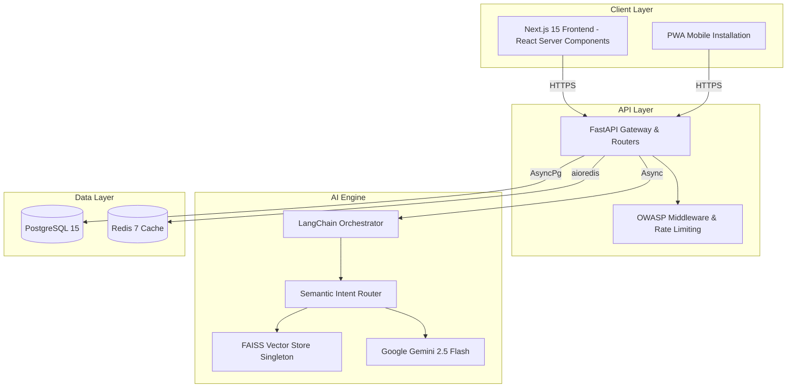
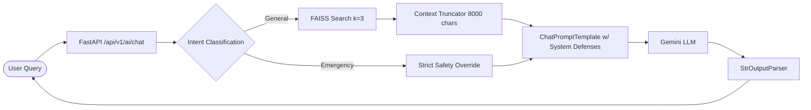

# StadiumMind AI - Architecture Guide

This document details the enterprise-grade architecture engineered for the StadiumMind AI hackathon submission.

## Overall System Architecture

StadiumMind AI utilizes a decoupled, containerized microservices architecture to ensure 1,000,000+ user scalability.

## The RAG (Retrieval-Augmented Generation) Pipeline

Our AI implementation strictly guards against hallucination and prompt injection via a robust LangChain Expression Language (LCEL) pipeline.

## Security & Scaling Strategy
- **Containerization:** Next.js outputs as a `standalone` node binary; FastAPI runs on `uvicorn` with optimized worker threads.
- **Singleton Memory:** FAISS indices and HuggingFace models are loaded exactly once per pod, eliminating blocking I/O overhead.
